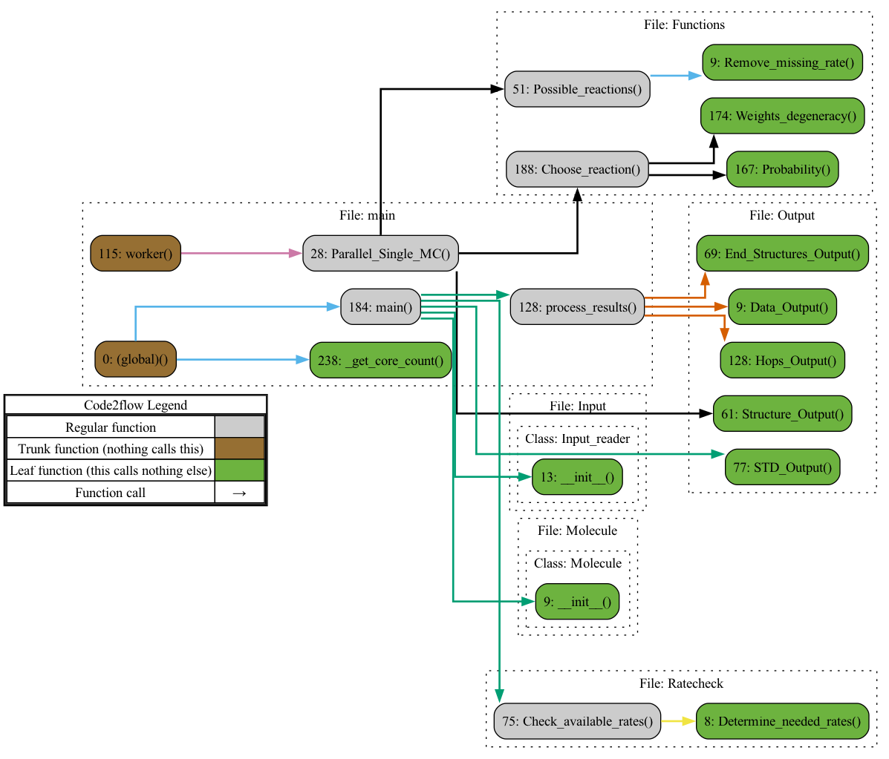

# PAH-MC

Monte Carlo Simulation on deuterated PAHs.

Associated research which include usage:

1. [Carels, E. J. Isotopic Effects Revealed Upon Photolysis of PAHs. (Universiteit van Amsterdam, 2023).](https://scripties.uba.uva.nl/search?id=record_53847)

## Installation

Install the prerequisites using Mamba or another environment manager:

```python
mamba create -n PAH-MC numpy
```

## Usage

How to run the program:

```bash
python main.py <inputfile> <cores> [-o <output>] [-l <log>]
```

The two statements in brackets are optional for if you want to specify a specific filename for either your output file or your log file, if not it standardly takes the name of your input file with .out or .log as an extension.

The number of cores specifies the number of parallel processes run.

If you are going to run this program on a supercomputer/computer cluster that uses SLURM for the job management, run the following:

```bash
sbatch mc_slurm.sh <inputfile> 
```

Number of processes and the optional arguments can be edited in the mc_slurm.sh file. Take mind to keep the number of cores specified for the program the same as the number of cores used in total (number of nodes times the number of tasks per node, both specified in the SBATCH statements).

This script has been successfully used on the Snellius computer cluster/supercomputer by Surf.

## How it works



## Credits and acknowledgements

This program was written by Emma Carels for a master project. It was updated by Tim de Groot for a subsequent bachelor project.
